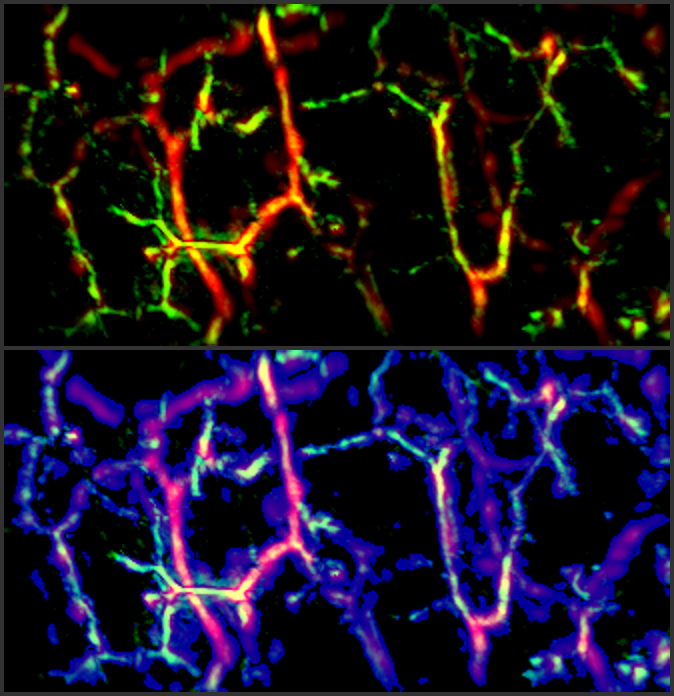
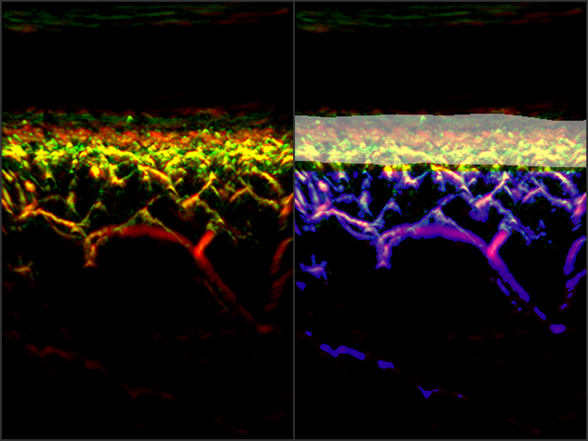
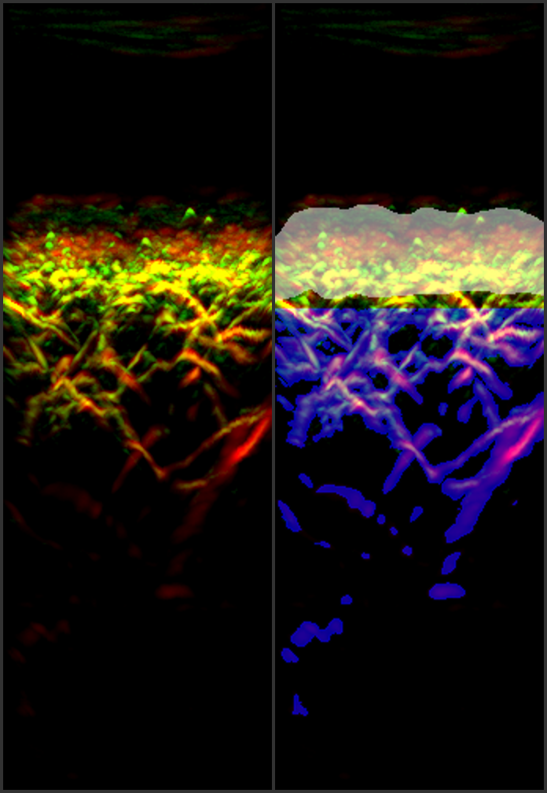

# RSOM epidermis and vessel segmentation in pytorch
  

## Preface
This reposity contains the python source code to perform segmentation 
of raster-scan optoacoustic mesoscopy (RSOM) data
([Aguirre J. et al., _Precision assessment of label-free psoriasis biomarkers with ultra-broadband optoacoustic mesoscopy_, Nat Biomed Eng 1, 0068 (2017) ](https://www.nature.com/articles/s41551-017-0068))

## Setup

This repository was tested on Ubuntu 16.04.6 LTS and 
18.04.3 LTS.

It uses git large file storage.
In order to work it correctly you need to install `git lfs` following [this manual for git lfs](https://git-lfs.github.com/).
As an alternative, you can clone the repository as usual, and download the large files in `./data/input` and `./data/models` manually.

A GPU with 16GiB memory is highly recommended.

The main python dependencies are
* nibabel
* torch

However, for a complete list, see and run

`pip install -r requirements.txt`

## Usage
In `./data/input` there are example matlab files, which serve as input.
Files must follow a naming scheme similar to `R_<datetime>_<letter-number identifier>_{LF,HF}.mat`.
Surface files, if present, must be named `Surf_<datetime>.mat`.
Currently there is no support for other input file types, however, writing a 
wrapper for any needed file format can be done with little effort.

To run the epidermis and vessel segmentation, run

`$ python pipeline.py`

If you want to change input and output files, or use cpu for
computation, edit `pipeline.py` accordingly.

If you have a smaller GPU, you can edit variable `divs=(1,1,2)`,
to `divs=(1,2,2)`, or even larger values. `divs` are the numbers, the input
tensor is split in each dimension, and closely related to the amount of memory required.

## Results

After successful segmentation, results are placed in `./data/output/`.
Furthermore, all tensors of all segmentation steps are placed in `./data/output/tmp`.
If one wishes to remove intermediate tensors, you can adjust that in `pipeline.py`.

**Maximum intensity projection of**
* input RSOM data
* RSOM data and segmentation result of vessels (blue) and epidermis (white).

 

## References

[[1]](https://arxiv.org/abs/1505.04597) Ronneberger, O., Fischer, P., Brox, T., _U-Net: Convolutional networks for biomedical image segmentation._

[[2]](https://arxiv.org/abs/1803.09340) Tetteh G. et al., _DeepVesselNet: Vessel Segmentation, Centerline Prediction, and Bifurcation Detection in 3-D Angiographic Volumes._

[[3]](https://www.nature.com/articles/s41551-017-0068) Aguirre J. et al. _Precision assessment of label-free psoriasis biomarkers with ultra-broadband optoacoustic mesoscopy_, Nat Biomed Eng 1, 0068 (2017)

    

